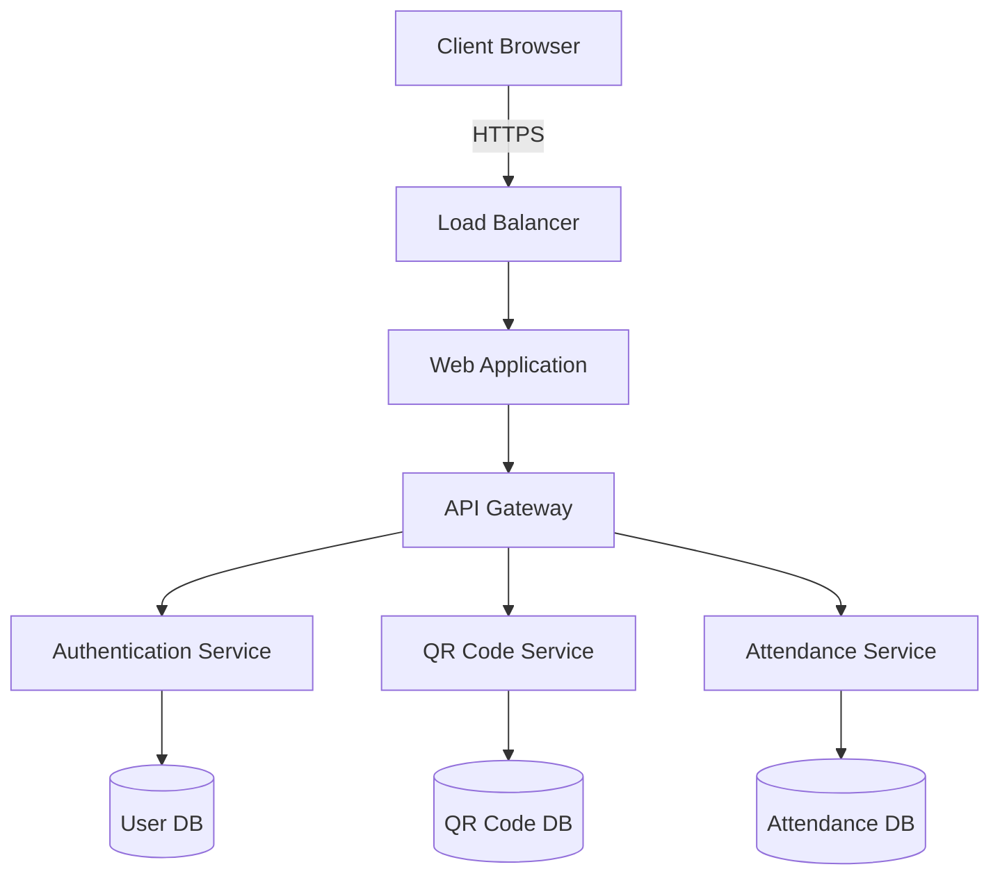

# QR Attendance Tracking System

A modern attendance management system that utilizes dynamic QR codes for efficient tracking and management of attendance records.

## Project Overview

This system provides a streamlined solution for managing attendance using dynamic QR codes. Built with modern technologies including:

- Frontend: React + TypeScript
- Build Tool: Vite
- Containerization: Docker
- CI/CD: GitHub Actions

### Key Features

- Dynamic QR code generation
- Real-time attendance tracking
- User authentication and authorization
- Attendance reports and analytics
- Mobile-responsive design

## Architecture



## Getting Started

### Prerequisites

- Node.js
- npm (Node Package Manager)

### Installation

1. Clone the repository
2. Install dependencies
```sh
npm install
```

3. Start the development server
```sh
npm run dev
```

## Deployment

To build the project for production:
```sh
npm run build
```

## Customization

You can customize the application by modifying the source files in the `src` directory.

## License

[Add your license information here]
