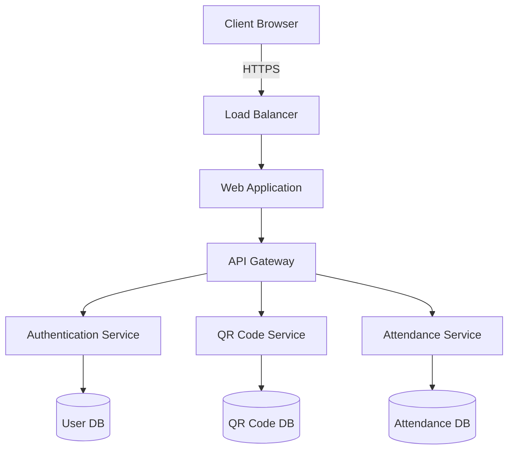

# QR Attendance Tracking System

A modern attendance management system that utilizes dynamic QR codes for efficient tracking and management of attendance records.

## Project Overview

This system provides a streamlined solution for managing attendance using dynamic QR codes. Built with modern technologies including:

- Frontend: React + TypeScript
- Build Tool: Vite
- Containerization: Docker
- CI/CD: GitHub Actions

### Key Features

- Dynamic QR code generation
- Real-time attendance tracking
- User authentication and authorization
- Attendance reports and analytics
- Mobile-responsive design

## Architecture



## Getting Started

### Prerequisites

- Node.js
- npm (Node Package Manager)

### Installation

1. Clone the repository
2. Install dependencies
```sh
npm install
```

3. Start the development server
```sh
npm run dev
```

## Deployment

To build the project for production:
```sh
npm run build
```

## Screenshots

Register page: (Student) 


Dashboard: (Admin)


QR Generation: (Admin)  


 **Note:**  
 Make sure you have the following prerequisites installed before running the project:
 - [Node.js](https://nodejs.org/) (v16 or later)
 - npm (comes with Node.js)
 - [Docker](https://www.docker.com/) – for containerized deployment (optional)
 - [Git](https://git-scm.com/) – to clone and manage the repository

 ✅ Recommended: Use [Visual Studio Code](https://code.visualstudio.com/) for development and [Postman](https://www.postman.com/) for API testing.

